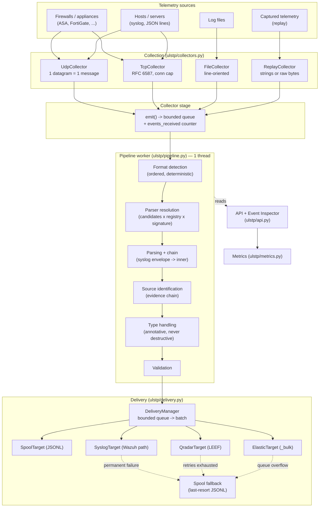
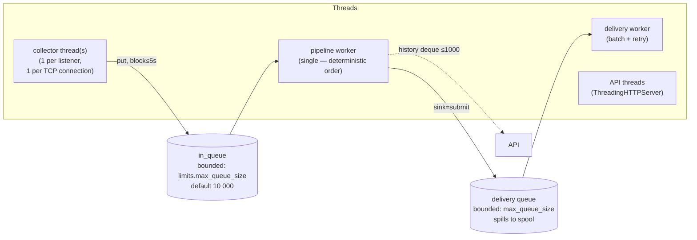
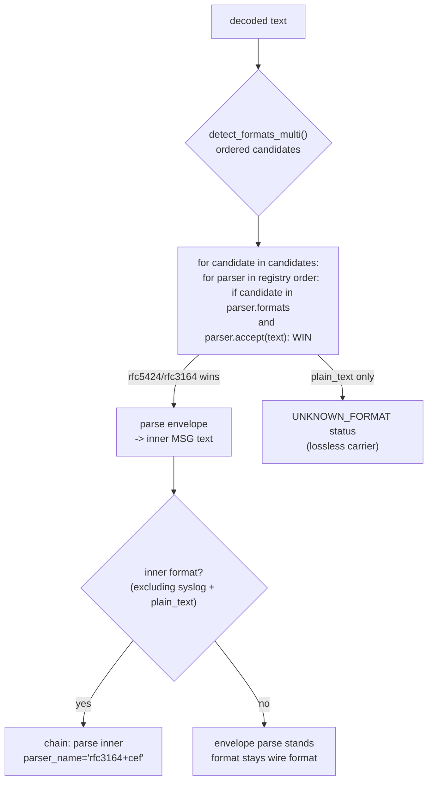

# ARCHITECTURE

ULSTP is a deterministic, AI-free telemetry pipeline: it collects messages,
identifies where they came from, parses them, and delivers a **lossless**
normalized event to the configured SIEM. It is not a SIEM, a detection engine,
or an analytics platform.

- Runtime: Python 3 standard library only. No third-party runtime dependencies.
- No ML/LLM/embeddings/fuzzy matching anywhere: parsing is grammar-, signature-,
  and configuration-based (Skill 02).
- Determinism contract: same input + same config + same parser version ⇒
  byte-identical structured output (enforced by `tests/test_limits.py::TestDeterminism`).

---

## 1. System overview



Key invariant: **no stage removes information.** Every arrow above only adds
layers to the event; the original message survives to the SIEM wherever the
wire format permits (always for JSON targets).

---

## 2. Component responsibilities (one owner each)

| Module | Owns | Must never do |
|---|---|---|
| `ulstp/collectors.py` | Acquiring bytes, transport metadata, transport-level limits, byte→text decode | Interpret message content |
| `ulstp/framing.py` | Message boundaries (RFC 6587 octet/newline), byte-size limits | Look inside a frame |
| `ulstp/format_detection.py` | Ordered format candidates for a text | Mutate the text |
| `ulstp/registry.py` | Parser order, resolution, inner chaining | Parse itself |
| `ulstp/parsers/*` | One format's grammar → `ParseResult` layers | Touch the event directly |
| `ulstp/source_id.py` | Identity (KNOWN/INFERRED/UNKNOWN) + evidence | Choose the parser (see §5 note) |
| `ulstp/normalize.py` | Merging `ParseResult` into the event, type annotation | Delete or replace values |
| `ulstp/delivery.py` | Wire serialization, batching, retry, spool | Fabricate success |
| `ulstp/api.py` | Inspection surface (read-only + `POST /api/parse`) | Become a management platform |
| `ulstp/config.py` | Schema validation, secret resolution | Contain secrets itself |
| `ulstp/runtime.py` | Wiring config → components, lifecycle | Business logic |
| `ulstp/event.py` | The lossless event model | — |

---

## 3. Stage-by-stage: what exists where

The event is built up in this exact order (`Pipeline._process_event`):

```text
Stage                Writes to event                    Failure behavior
───────────────────  ─────────────────────────────────  ─────────────────────────────
collect + decode     raw_message, raw_bytes_b64,        counted LIMIT_EXCEEDED /
                     transport.*, decode_notes          DECODE_ERROR, event rejected
                                                        (never yet parsed ⇒ nothing lost
                                                        but the raw bytes are counted)
format detection     (candidates, local only)           always succeeds; worst case
                                                        candidate = "unknown"
parser resolution    parser_name (may be None)          None ⇒ plain_text fallback with
                                                        parse_status=UNKNOWN_FORMAT
parsing              decoded, protocol_metadata,        FAILED ⇒ status recorded, raw
                     normalized, vendor_fields,         preserved; PARTIAL ⇒ extracted
                     unknown_fields, original_fields,   + remainder both kept
                     parse_notes
type handling        validation_problems (values kept)  invalid value ⇒ annotated, never
                                                        removed or replaced
field limits (§39)   FIELD_LIMIT*_EXCEEDED notes,       exceeding ⇒ annotated + counted
                     truncated flag                     (values preserved), never removed
validation           validation_status                  INVALID ⇒ data preserved
delivery             delivery_status/target/attempts    FAILED ⇒ retry ⇒ SPOOLED
```

---

## 4. Threading and queues



- Overflow behavior is explicit and counted, never silent:
  - `in_queue` full after 5 s backpressure ⇒ `CollectorError`, counter
    `events_queue_overflow`, `error.QUEUE_ERROR`.
  - delivery queue full ⇒ event routed to spool, counter `delivery_queue_overflow`.
- `Pipeline.history()` is a bounded deque (1000) backing the API/UI.

---

## 5. Parser resolution and the identification-order note



> Design note (§20 wiring, closed): the pipeline consults matched configured
> sources BEFORE parser resolution. A source's `parser_hint` steers selection —
> hinted parser first, standard candidate walk as deterministic fallback, and
> the decision (`hint_used` / `hint_rejected_fallback`) recorded as a parse
> note. A hint never bypasses a parser's signature check; the configured match
> is evaluated exactly once and reused by identification.

---

## 6. Extension points (§48 of the build plan)

| To add | Do | Files touched |
|---|---|---|
| A parser | Subclass `Parser` (name, version, formats, `accept`, `_parse`), add to `DEFAULT_REGISTRY_ORDER` | `ulstp/parsers/<fmt>.py`, `ulstp/registry.py`, corpus + golden case, `docs/parsers/` page |
| A vendor key mapping | One line in the parser's `*_KEY_MAP` | e.g. `ulstp/parsers/cef.py` |
| A source signature | One row in `_SIGNATURES` (research-gated: no invented signatures) | `ulstp/source_id.py` |
| A SIEM target | Subclass `DeliveryTarget.deliver(events)->delivered`, wire in `runtime.build_delivery` | `ulstp/delivery.py`, `ulstp/runtime.py` |
| A limit | Field on `ResourceLimits` + enforcement at the owning boundary | `ulstp/limits.py` + collector/parser |

No core redesign is required for any of the above — that is the §48 contract.
