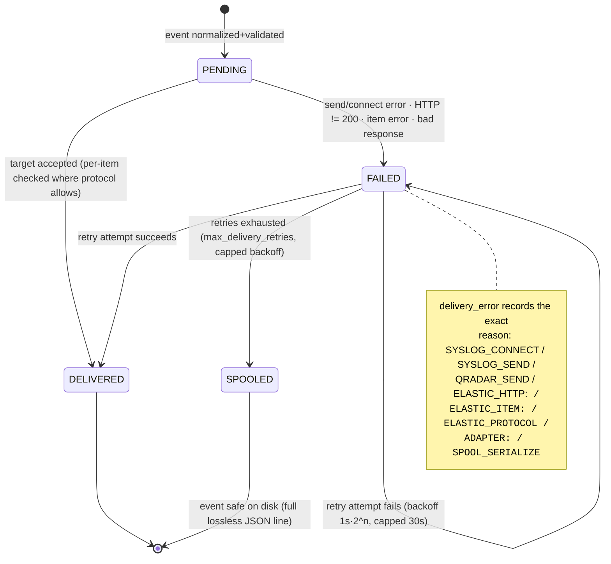
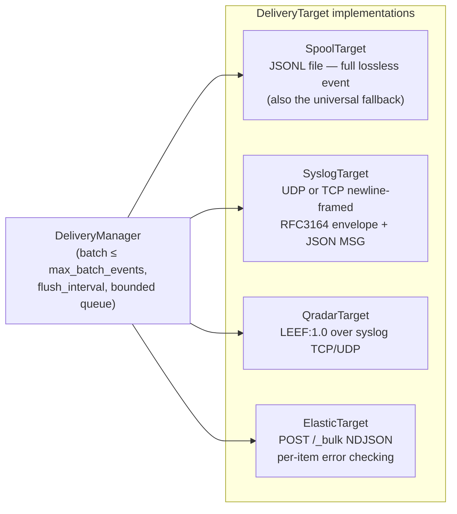

# SIEM DELIVERY

How lossless events reach the configured SIEM (build plan §16, §29, §30;
Skill 06). Two absolute rules govern this layer:

1. **Never claim delivered that did not happen** — statuses are determined by
   real wire/HTTP outcomes, per item where the protocol allows.
2. **Never silently discard** — every failure path ends in retry or spool.

## 1. Delivery state machine



## 2. Targets



Only the configured target receives events (`siem.type`); the spool target is
always available as the last-resort path (`siem.spool_path`, default
`ulstp-spool.jsonl`).

### Serialization per target (what the wire sees)

| Target | Wire format | Lossless layers carried | Raw recovery after delivery |
|---|---|---|---|
| **SpoolTarget** | one JSON line per event — `event.dict_event()` | **all layers**, nothing dropped | exact (`tests/test_delivery.py::TestSpoolTarget`) |
| **SyslogTarget** (Wazuh) | `<PRI>Mmm d hh:mm:ss host TAG: <JSON>` + LF. PRI default 134, TAG default `ulstp` (both configurable). TCP = newline framing (wazuh-remoted safe), UDP = datagram | full event JSON embedded in MSG | exact via JSON parse (asserted) |
| **QradarTarget** | `LEEF:1.0|vendor|product|1.0|eventid\tattr=value…` — vendor/product from deterministic source identification | `sev`, `src`, `dst`, `raw` (tab/newline-escaped), every unknown field as `u_<key>`, every vendor field as `v_<key>` | `raw=` attribute + all `u_`/`v_` attributes |
| **ElasticTarget** | `POST /_bulk`, `application/x-ndjson`: `{"index":{"_index":"ulstp-YYYY.MM.dd"}}` + flattened event source line | flattened dict — all layers present as `raw.raw_message`, `normalized.*`, `unknown.*`, … | exact via `raw.raw_message` |

QRadar attribute keys are sanitized (`[^A-Za-z0-9_.-]` → `_`) and values escaped
(`\`, tab, CR, LF); IBM permits arbitrary key=value attributes, so nothing is
invented and nothing dropped.

### Honesty mechanics (the part that matters)

- **Elasticsearch**: HTTP 200 is not success. The response body is parsed;
  `errors:true` or item-count mismatch ⇒ per-item status. Item failures set
  `delivery_status=FAILED` with `ELASTIC_ITEM:<error>` while siblings in the
  same batch are `DELIVERED` (verified against a real local HTTP server,
  `tests/test_delivery.py::TestElasticTarget::test_per_item_errors_not_claimed_delivered`).
- **Connection refused** ⇒ `FAILED` with `SYSLOG_CONNECT:…`, never DELIVERED
  (verified: `TestSyslogTarget::test_connection_refused_is_failure_not_success`).
- **Adapter crash** ⇒ caught, `ADAPTER:<exception>` recorded, batch goes to
  retry — the delivery worker never dies silently.
- **Credentials** (Elasticsearch API key) resolve from an **environment
  variable named in config** (`api_key_env`) — never inline config, never logs,
  never events.

## 3. Batching, retry, spool — parameters

| Setting | Where | Default | Meaning |
|---|---|---|---|
| `batch_size` | `siem.batch_size` | 100 | events per delivery call (capped by `limits.max_batch_events`) |
| `flush_interval` | `siem.flush_interval` | 1.0 s | max wait for a full batch |
| `max_delivery_retries` | `limits` | 5 | passes before spool fallback |
| `retry_backoff_seconds` | `limits` | 1.0 | base backoff (exponential, 30 s cap) |
| `max_spool_bytes` | `limits` | 256 MiB | spool size bound (config) |
| `spool_path` | `siem.spool_path` | `ulstp-spool.jsonl` | fallback file |

## 4. Example configuration

```json
{
  "siem": {
    "type": "elastic",
    "url": "https://elastic.internal:9200",
    "index_prefix": "ulstp",
    "api_key_env": "ULSTP_ES_API_KEY",
    "batch_size": 200,
    "flush_interval": 2.0,
    "spool_path": "/var/spool/ulstp/events.jsonl"
  }
}
```

## 5. Known limitations (honesty section)

1. **Live-SIEM verification pending.** All adapters are tested against real
   local receivers (real sockets, real `http.server`), but not yet against a
   live Wazuh manager, QRadar appliance, or Elasticsearch cluster — the single
   open item in `docs/BUILD_STATUS.md` (build plan §60 procedure).
2. **Dual-queue backpressure.** The pipeline→delivery handoff is a second
   bounded queue; a sustained target outage fills the spool path rather than
   applying end-to-end backpressure to collectors. Bounded and counted, but
   worth knowing before high-volume deployments.
3. **No TLS syslog output yet.** TLS is supported on the Elasticsearch side via
   `https://`; the syslog/LEEF adapters currently do plain TCP/UDP (documented
   extension point in `docs/ARCHITECTURE.md` § Extension points).
4. **`parser_hint` is recorded but not yet routed** into parser selection
   (evidence only) — see `docs/ARCHITECTURE.md` §5 note.
