# THE LOSSLESS EVENT MODEL

The event is the platform's core contract (build plan §10/§11, Skill 03).
Nothing that any stage knows about a message may be lost: normalization is a
mapping **on top of** preserved originals, never a replacement for them.

## 1. Layer anatomy

```mermaid
flowchart TB
    EV["LosslessEvent (ulstp/event.py)"]

    EV --> ING["ingestion\nevent_id · ingested_at"]
    EV --> TRA["transport\nudp/tcp/file/replay · peer · ports\nsource_name · file path/line"]
    EV --> RAW["raw ★ SACRED\nraw_message (exact original)\nraw_bytes_b64 (byte-exact,\nwhen input is not valid UTF-8)\ntruncated flag"]
    EV --> PRO["protocol_metadata\nsyslog.facility/severity/pri\ncisco.msgid/daemon"]
    EV --> DEC["decoded\nformat-level view:\nsyslog header, CEF header, kv_pairs"]
    EV --> SRC["source\nKNOWN/INFERRED/UNKNOWN\nvendor · product · hostname\nevidence chain"]
    EV --> PARS["parser\nname (+chain) · version\nPARSED/PARTIAL/FAILED/UNKNOWN_FORMAT\nnotes · format_detected · duration"]
    EV --> NORM["normalized\nstandardized names + typed values"]
    EV --> VEN["vendor ★\nmapped vendor-specific fields"]
    EV --> UNK["unknown ★\nunmapped fields — never discarded"]
    EV --> ORI["original ★\noriginal string of every\nconverted/mapped value"]
    EV --> VAL["validation\nVALID/INVALID + problems\n(values preserved)"]
    EV --> DEL["delivery\nPENDING/DELIVERED/FAILED/SPOOLED\ntarget · error · attempts"]

    style RAW fill:#3a1f1f,stroke:#c33,color:#fdd
    style ORI fill:#3a2a10,stroke:#da4,color:#fed
    style VEN fill:#3a2a10,stroke:#da4,color:#fed
    style UNK fill:#3a2a10,stroke:#da4,color:#fed
```



★ = the four preservation layers. Together with `raw`, they make the event a
**superset** of the original message's information content.

## 2. The guarantee, formally

For every event, all of the following hold (and are asserted by tests):

1. `raw.raw_message == exact input text` (collection → pipeline → serialization).
2. If the transport bytes were not valid UTF-8, `raw.raw_bytes_b64` decodes to
   **byte-exact** original (`tests/test_golden.py::TestLossless`).
3. Every field the parsers saw appears in at least one of
   `normalized` / `vendor` / `unknown` / `decoded`.
4. Every value that was converted or mapped keeps its original string in
   `original.*` (e.g. quoted `"root"` vs unquoted `root`).
5. Partial understanding never discards the remainder: the unparsed part lives
   on in `raw` + `original.*` + `unknown.*`, and `parser.status` says PARTIAL.
6. Type problems annotate (`validation.problems`) but never delete:
   `source.ip = "999.999.1.1"` stays, flagged.
7. Unknown sources/formats are **valid events** (`UNKNOWN_FORMAT`), delivered
   like any other, never dropped.

The no-silent-loss test principle (§53): *input exists ⇒ output contains the
original input, or an explicit failure/preservation path*. Verified across the
malformed corpora in `tests/telemetry/*/malformed.py`.

## 3. Worked example — Cisco ASA through the pipeline

Input (RFC 3164 envelope carrying a Cisco token):

```text
<163>Jan 12 10:22:11 FW01 : %ASA-6-302013: Built outbound TCP connection 9 for
outside:10.1.2.1/22 (10.1.2.1/22) to inside:10.1.1.2/53496 (10.1.1.2/53496)
```

What each layer ends up containing (real capture; ids/duration elided):

| Layer | Contents |
|---|---|
| `raw` | the exact line above |
| `protocol_metadata` | `syslog.rfc=3164`, `facility=20`, `severity=3`, `pri=163`, `cisco.msgid=302013`, `cisco.daemon=ASA` |
| `decoded` | RFC3164 header fields + `cisco_token/cisco_severity/cisco_msgid/cisco_body` |
| `source` | `INFERRED`, `vendor=Cisco`, `product=ASA`, evidence: `signature=sig_cisco_asa`, `signature_match=%ASA-6-302013:` |
| `parser` | `rfc3164+cisco_asa` (envelope+inner chain), `PARSED`, notes: year inferred from reference-year policy |
| `normalized` | `@timestamp=2026-01-12T10:22:11Z`, `source.ip=10.1.2.1`, `source.port=22`, `destination.ip=10.1.1.2`, `destination.port=53496`, `network.transport=tcp`, `cisco.connection_id=9`, `event.severity=6`, … |
| `original` | `original.pri=<163>`, `original.timestamp=Jan 12 10:22:11`, `original.cisco.token=%ASA-6-302013`, `original.cisco.first_tuple=outside:10.1.2.1/22`, … |

Note two deterministic inferences, both **recorded, not hidden**: the RFC3164
timestamp carries no year (normalized via the reference-year policy, noted), and
the PRI severity (3) legitimately differs from the in-token ASA severity (6) —
both are kept, neither overrides the other.

## 4. Worked example — CEF with an unknown vendor key

Input:

```text
CEF:0|Security|threat-manager|1.0|100|Web login failure|10|src=10.0.0.5 dst=8.8.8.8 spt=1111 msg=Trojan activity WeirdField=abc
```

| Layer | Demonstrates |
|---|---|
| `normalized` | `source.ip=10.0.0.5`, `destination.ip=8.8.8.8`, `source.port=1111` (int), `event.severity=10`, `message=Trojan activity`, full `cef.*` header |
| `unknown` | `cef.ext.WeirdField=abc` — an unmapped vendor key, preserved (Rule 9) |
| `original` | `original.cef.header` (raw, pipes intact) plus raw string per extension key |
| `source` | `INFERRED` via `cef_header=Security|threat-manager` |

## 5. Worked example — FortiGate: mapped AND vendor layers

Input:

```text
date=2026-09-09 time=10:22:11 logid=0000000013 type=event subtype=system level=information vd="root" srcip=10.0.0.5 dstip=8.8.8.8 msg="Config applied"
```

* `normalized`: `@timestamp=2026-09-09T10:22:11Z`, `source.ip`, `destination.ip`,
  `log.level=information`, `fortigate.vdom=root` (unquoted), `message=Config applied`
* `vendor`: **every** FortiGate key, verbatim (`fortigate.vd="root"` — note the
  original quoting is preserved here)
* `original`: every key's raw string, including the quotes

This is the §17–§19 pattern in one event: the vendor representation is never
destroyed by normalization.

## 6. JSON event shape

`event.to_json()` / `dict_event()` emit all layers with only string keys —
safe for every JSON-capable SIEM target. Field paths use dots and are
delivered flattened for Elasticsearch (action line + flattened source line,
NDJSON). See `docs/DELIVERY.md` for target-by-target mapping.

## 7. What the model explicitly does NOT do

- No silent truncation: `truncated` exists but no code path sets it today;
  oversize ends in counted rejection instead (documented §39 behavior).
- No severity "correction": syslog PRI severity and vendor severity are both
  kept when they disagree (devices misconfigure this; we preserve the evidence).
- No timestamp fabrication: year-less RFC3164 timestamps normalize only via the
  explicit reference-year policy, always with a `TIMESTAMP_YEAR_INFERRED` note.
