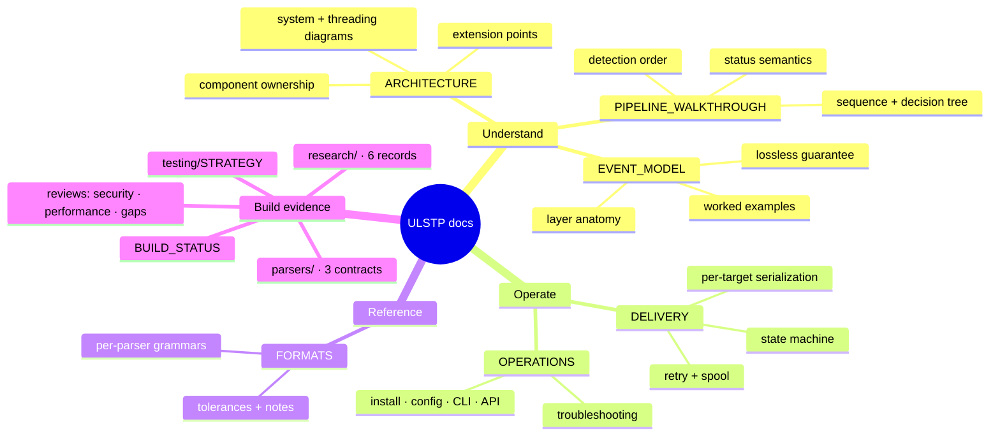

# DOCUMENTATION INDEX

Universal Lossless SIEM Telemetry Platform — every document, organized by
audience. Documentation corresponds to the actual implementation; known gaps are
stated in place rather than papered over (Skill 10).

## Start here

| If you are... | Read in this order |
|---|---|
| **Evaluating the project** | [README](../README.md) → [ARCHITECTURE](ARCHITECTURE.md) §1–2 → [EVENT_MODEL](EVENT_MODEL.md) §2 |
| **Deploying / operating** | [OPERATIONS](OPERATIONS.md) → [DELIVERY](DELIVERY.md) → [PIPELINE_WALKTHROUGH](PIPELINE_WALKTHROUGH.md) §5 |
| **Understanding a specific event** | [PIPELINE_WALKTHROUGH](PIPELINE_WALKTHROUGH.md) → [EVENT_MODEL](EVENT_MODEL.md) → [FORMATS](FORMATS.md) |
| **Adding a parser / SIEM target** | [ARCHITECTURE](ARCHITECTURE.md) §6 (extension contract) → the matching `docs/parsers/` page → [testing/STRATEGY](testing/STRATEGY.md) |
| **Auditing the build** | [BUILD_STATUS](BUILD_STATUS.md) → the three reviews (below) → [testing/STRATEGY](testing/STRATEGY.md) |

## Core documents

| Document | Contents |
|---|---|
| [ARCHITECTURE.md](ARCHITECTURE.md) | System overview (Mermaid), component responsibilities, stage table, threading/queues, parser resolution, extension points |
| [EVENT_MODEL.md](EVENT_MODEL.md) | The lossless event layer-by-layer, the formal guarantee, three worked examples with real captured output |
| [PIPELINE_WALKTHROUGH.md](PIPELINE_WALKTHROUGH.md) | One message end-to-end (sequence diagram + decision tree), detection order, identification priority, status meanings |
| [FORMATS.md](FORMATS.md) | Per-parser grammar, what is extracted vs tolerated vs preserved, real before/after, known deviations |
| [DELIVERY.md](DELIVERY.md) | Delivery state machine, per-target wire serialization, honesty mechanics, batching/retry/spool parameters |
| [OPERATIONS.md](OPERATIONS.md) | Installation, full configuration reference, running, CLI + API reference, troubleshooting matrix |

## Build evidence (traceability chain)

Every major decision follows **requirement → research → design → implementation
→ test → verification**; these directories hold the evidence:

| Path | Contents |
|---|---|
| `docs/research/` | 6 research records: syslog RFCs 3164/5424/6587, CEF+LEEF, KV/JSON/CSV/plaintext, Cisco ASA+FortiGate vendors, SIEM targets, with [INDEX](research/INDEX.md) |
| `docs/parsers/` | Parser contracts: [Cisco ASA](parsers/cisco-asa.md), [FortiGate](parsers/fortigate.md), [syslog/CEF/LEEF](parsers/syslog-cef-leef.md) |
| `docs/testing/STRATEGY.md` | Test layout, results, mapping of required test classes to the build plan, live-SIEM verification status |
| [SECURITY_REVIEW.md](SECURITY_REVIEW.md) | Input-hardening review (oversize, depth, injection, resource limits) |
| [PERFORMANCE_REVIEW.md](PERFORMANCE_REVIEW.md) | Measured throughput/latency/memory, optimization-without-loss constraints |
| [RESEARCH_GAP_ANALYSIS.md](RESEARCH_GAP_ANALYSIS.md) | Which vendors/formats/variants remain unparsed — honest coverage statement |
| [REPOSITORY_ANALYSIS.md](REPOSITORY_ANALYSIS.md) | Pre-build repository inspection record |
| [BUILD_STATUS.md](BUILD_STATUS.md) | Phase/step/objective tracker, completed requirements with evidence pointers, known limitations, next action |
| `skills/` | The ten mandatory engineering skills governing this build ([INDEX](../skills/INDEX.md)) |

## Honest-limitations map (where each known gap is documented)

| Gap | Documented in |
|---|---|
| Live Wazuh/QRadar/Elastic delivery not yet verified against real instances | [testing/STRATEGY](testing/STRATEGY.md), [BUILD_STATUS](BUILD_STATUS.md) |
| API unauthenticated (loopback default) | [SECURITY_REVIEW](SECURITY_REVIEW.md), [OPERATIONS](OPERATIONS.md) §5 |
| UDP is lossy at transport level; no ack/replay | README § Known limitations |
