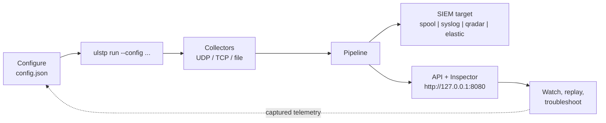

# OPERATIONS GUIDE — install, run, configure, troubleshoot

Everything needed to operate ULSTP in one place. For design rationale see
`ARCHITECTURE.md`; for wire formats see `FORMATS.md`; for delivery semantics see
`DELIVERY.md`.



---

## 1. Installation

Requirements: **Python 3.10+** (developed and tested on 3.14). No third-party
runtime dependencies — the platform is standard library only (zero `pip install`
at runtime; `pytest` only for the test suite).

```bash
git clone https://github.com/wassimrahoui/log-parser.git
cd log-parser
python -m pytest tests/ -q        # sanity: 106 tests, should pass in seconds
```

The process needs to bind its listener ports and the API port. Ports 514/5514
(UDP syslog) typically require privileges; the example config avoids this by
using 5514/5601/8080.

---

## 2. Configuration reference (`config.example.json`)

One JSON file drives everything. Full example with every section:

```json
{
  "limits": {
    "max_message_bytes": 65536,
    "max_queue_size": 10000,
    "max_connections": 256
  },
  "listeners": [
    { "type": "udp",  "host": "0.0.0.0", "port": 5514 },
    { "type": "tcp",  "host": "0.0.0.0", "port": 5601 },
    { "type": "file", "path": "C:/logs/app.log", "follow": true }
  ],
  "sources": [
    {
      "source_id": "firewall-a",
      "transport": "udp",
      "peer_ip": "10.0.0.1",
      "vendor": "Fortinet",
      "product": "FortiGate",
      "parser_hint": "fortigate"
    }
  ],
  "siem": {
    "type": "spool",
    "path": "ulstp-events.jsonl"
  },
  "api": { "enabled": true, "host": "127.0.0.1", "port": 8080 }
}
```

### 2.1 `limits` (resource envelope — `ulstp/limits.py`)

| Key | Default | Effect |
|---|---|---|
| `max_message_bytes` | 262144 | Frame/dgram above this ⇒ counted `LIMIT_EXCEEDED`, raw bytes counted, never parsed |
| `max_field_bytes` | 8192 | Extracted field larger than this ⇒ `FIELD_LIMIT_EXCEEDED` note + `truncated` flag; value preserved (annotation, not deletion) |
| `max_field_count` | 512 | More extracted fields than this ⇒ `FIELD_COUNT_LIMIT_EXCEEDED` note; values preserved |
| `max_queue_size` | 10000 | Bounded queues: collector→pipeline and pipeline→delivery |
| `max_connections` | 256 | Concurrent TCP connections per listener |

> Honesty note: `max_message_bytes`, `max_queue_size`, `max_connections`, and
> (inside the JSON parser) `max_nested_depth` are enforced at their owning
> boundaries. `max_field_bytes` / `max_field_count` are enforced at the merge
> stage as **annotation, not deletion**: exceeding fields get explicit
> `FIELD_LIMIT_EXCEEDED` / `FIELD_COUNT_LIMIT_EXCEEDED` notes and the
> `truncated` flag, while every value is preserved losslessly (Skill 03 — a
> limit never deletes telemetry).

### 2.2 `listeners` (`ulstp/collectors.py`)

| Type | Required keys | Behavior |
|---|---|---|
| `udp` | `host`, `port` | One datagram = one message; OS truncation (WSAEMSGSIZE) counted as limit event |
| `tcp` | `host`, `port` | RFC 6587: octet-counted OR newline framing, auto-detected per connection |
| `file` | `path` (optional `follow`) | Line-oriented; existing content is read, then followed |

### 2.3 `sources` (deterministic source identity — `ulstp/source_id.py`)

A source matches when `transport` + `peer_ip` (or `file_path` / `port`) equal
the transport metadata. Match ⇒ identity **KNOWN** with this evidence chain:

```text
configured_source=firewall-a  transport=udp  peer=10.0.0.1
```

`vendor`/`product` label the identity. When a source matches, its
`parser_hint` steers parser resolution: the hinted parser is tried first and
the standard candidate walk takes over if it rejects (the decision is recorded
as a `PARSER_HINT:hint_used|hint_rejected_fallback:<name>` parse note). A hint
never bypasses a parser's signature check. Unknown peers still parse: identity **UNKNOWN** is a
valid state, never a rejection (§12 of the build plan).

### 2.4 `siem` (one target — `ulstp/delivery.py`)

| `type` | Required keys | Wire format |
|---|---|---|
| `spool` | `path` | JSONL, one full lossless event per line — the lossless ground truth |
| `syslog` | `host`, `port` (optional `transport`: `udp`/`tcp`) | Syslog packet; MSG = compact JSON of the full event (Wazuh path) |
| `qradar` | `host`, `port` | LEEF 1.0 over syslog, tab-separated, SP-pairs escaped |
| `elastic` | `url`, optional `index_prefix`, `api_key_env`, `batch_size` | `_bulk` NDJSON, `{"index":{"_index":"ulstp-<date>"}}` per event |

Per-target failure semantics (retry → spool fallback, per-item Elasticsearch
errors never reported as success): `DELIVERY.md` §1–§3.

### 2.5 Secrets

Credentials are **never** in config values. Point at an environment variable:

```json
{ "type": "elastic", "url": "https://es.internal:9200", "api_key_env": "ES_API_KEY" }
```

The variable must be set when the process starts (`ES_API_KEY=... ulstp run ...`)
or startup fails with a `ConfigError` naming the missing variable. Secret values
are excluded from logs and from events.

### 2.6 Validation errors you can hit

| Message | Cause |
|---|---|
| `siem.type must be spool\|syslog\|qradar\|elastic` | typo in `siem.type` |
| `siem.type=syslog requires 'host' and 'port'` | target endpoint incomplete |
| `unknown limit keys: [...]` | a `limits` key that doesn't exist — config fails fast rather than silently ignoring |
| `environment variable ES_API_KEY ... is not set` | secret missing at startup |

---

## 3. Running

```bash
# production shape: collectors + pipeline + delivery + API
python -m ulstp.cli run --config config.json

# inspection sandbox: API/UI only, no listeners (safe on a laptop)
python -m ulstp.cli serve --api-port 8080
```

`run` stays in the foreground; Ctrl+C stops listeners and drains queues. Exit
status and counters are on `GET /metrics`.

---

## 4. CLI reference (`python -m ulstp.cli <cmd> --help`)

| Command | Arguments | What it does |
|---|---|---|
| `run` | `--config CONFIG` | Full runtime: collectors → pipeline → delivery → API |
| `parse` | `[input]` (or stdin) | Parse one message, print the **full lossless event JSON** — the fastest way to see exactly what any input produces |
| `replay` | `file` · `--config` · `--summary` · `--api` | Feed saved raw telemetry (one message per line, or blank-line separated for multiline events) through the real pipeline; `--summary` prints per-status counts, `--api` serves the Inspector |
| `test-parser` | `[parser]` · `--input INPUT` | Show which parser accepts an input and what it extracts |
| `serve` | `--api-port` | API/UI without listeners |

Examples:

```bash
python -m ulstp.cli parse "<134>Jan 12 10:22:11 FW01 sshd[123]: hello"
python -m ulstp.cli test-parser cef --input "CEF:0|V|P|1|s|n|5|src=1.2.3.4"
python -m ulstp.cli replay capture.txt --summary
```

Replay is deterministic: the same file always yields the same events
(`tests/test_limits.py::TestDeterminism` proves it for the pipeline).

---

## 5. API & Event Inspector

`serve`/`run` expose (loopback by default):

| Endpoint | Method | Purpose |
|---|---|---|
| `/` | GET | Event Inspector UI — browse recent events, expand every lossless layer |
| `/health` | GET | Liveness + component status |
| `/metrics` | GET | Counters: received/parsed/failed/unknown/oversized/queue-overflow/delivery per status |
| `/api/events?limit=N` | GET | Recent events (bounded history, 1000) |
| `/api/events/{id}` | GET | One event, all layers |
| `/api/parse` | POST | Parse a raw message through the real pipeline (same code path as collectors) — returns the lossless event without delivering it |

Notes: the API binds `127.0.0.1` by default; exposing it beyond loopback is an
operator decision (no authentication — see `SECURITY_REVIEW.md`). `GET /` only
serves the Inspector; there are no other UI routes.

---

## 6. Troubleshooting

| Symptom | Likely cause | What to do |
|---|---|---|
| Event shows `parse_status: UNKNOWN_FORMAT` but content looks structured | Format falls outside the researched parser set | Check `parser` layer notes + `unknown` fields (everything is preserved); add a parser via the §48 extension path (`ARCHITECTURE.md` §6) |
| Event status `PARTIAL` with note `ASA_BODY_NOT_SUBPARSED` | Cisco ASA message ID without a researched sub-grammar (by design — no invented fields) | Body is preserved verbatim; contribute the sub-grammar only from corroborated samples (Skill 01) |
| `LIMIT_EXCEEDED` counter climbing | A sender exceeds `max_message_bytes` | Find the peer via `/metrics` + collector notes; raise the limit consciously or fix the sender |
| `events_queue_overflow` climbing | Pipeline can't keep up or delivery is stalled | Check delivery status/`/metrics`; queue is bounded by design (backpressure, never unbounded memory) |
| Delivery stays `SPOOLED` | Target down during send | Events are in the spool JSONL with full fidelity; fix the target, replay the spool file through `ulstp.cli replay` |
| Elastic shows partial success | Some items in a `_bulk` batch failed | Per-item errors are parsed and counted — never reported as DELIVERED; inspect `delivery` layer attempts |
| Wrong timestamps from RFC 3164 sources | No year in BSD format | Reference-year policy applies and is always noted (`TIMESTAMP_YEAR_INFERRED`); feed RFC 5424 where possible |
| `parse` output has a `vendor` field I didn't expect | Vendor-specific keys are preserved verbatim in the vendor layer, in addition to any normalized mapping | That's the lossless contract (`EVENT_MODEL.md` §2) — normalize adds, never replaces |

Golden rule: **if telemetry reached ULSTP, it exists somewhere in the output** —
search the spool JSONL for the raw text and work backwards through the event's
layers.
