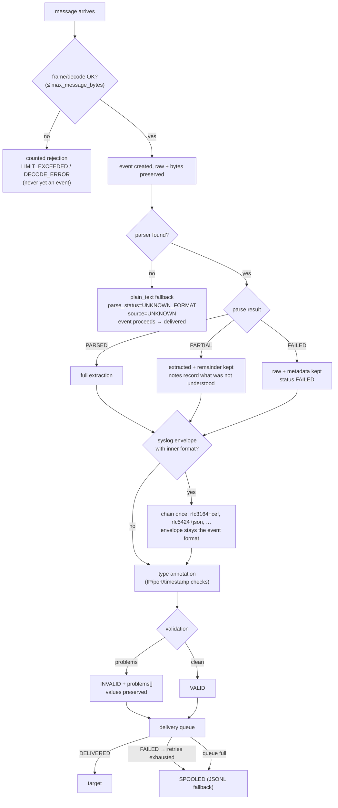

# PIPELINE WALKTHROUGH — one message, end to end

A trace of a single FortiGate message from a firewall to the spool target,
showing every decision point. The same path is exercised by
`tests/test_api_cli.py::TestRuntime::test_runtime_e2e_udp_to_spool_and_api`.

## 1. Sequence diagram

```mermaid
sequenceDiagram
    autonumber
    participant FW as FortiGate 10.0.0.1
    participant U as UdpCollector
    participant Q as in_queue (bounded)
    participant P as Pipeline worker
    participant R as ParserRegistry
    participant S as SourceIdentifier
    participant D as DeliveryManager
    participant T as SpoolTarget (JSONL)

    FW->>U: UDP datagram :5514 (RFC3164 + KV payload)
    U->>U: frame_datagram (size pre-check)
    U->>U: decode_message (UTF-8 strict; latin-1+b64 fallback)
    U->>Q: LosslessEvent(raw_message, transport=udp, peer_ip) [events_received++]
    Q->>P: get()
    P->>P: detect_formats_multi → ["key_value"]
    P->>R: resolve(["key_value"], text)
    R-->>P: FortiGateParser (signature logid=… hits first)
    P->>P: parse → fields/vendor/originals/decoded
    P->>S: identify(event)
    S-->>P: INFERRED Fortinet/FortiGate (evidence: sig_fortigate)
    P->>P: finalize_types (annotate, never delete)
    P->>P: validation → VALID
    P->>D: sink = submit(event)
    D->>D: batch → target.deliver()
    alt target up
        D->>T: (not used — target delivered)
    else target down / retries exhausted
        D->>T: write full lossless JSON line [events_spooled++]
    end
```

## 2. Decision tree — what can happen to any message



## 3. Format detection order (why your message parses the way it does)

First match wins; each rule is a pure function of the text
(`ulstp/format_detection.py`):

| # | Rule (essence) | Format |
|---|---|---|
| 1 | `<PRI>` + nonzero digits + space (RFC5424 VERSION) | `rfc5424` |
| 2 | `CEF:<n>\|` marker | `cef` |
| 3 | `LEEF:<n>.<m>\|` marker | `leef` |
| 4 | leading `{` | `json` |
| 5 | `Mmm dd hh:mm:ss` (PRI optional) | `rfc3164` |
| 6 | ≥2 `key=` anchors | `key_value` |
| 7 | XML declaration/element | `xml` |
| 8 | tab present / strict delimiter heuristic | `csv` |
| 9 | everything else | `plain_text` → pipeline reports `unknown` |

Consequences worth knowing:

- A CEF message inside RFC3164 gets **both** grammars applied (chain), and its
  `format_detected` stays `rfc3164` (the wire format), with the inner parse
  visible as `parser = rfc3164+cef`.
- A pure-TSV record currently detects as `csv` but the registry's CSV parser is
  comma-only — known gap (see `docs/DELIVERY.md` → limitations), falls to
  `unknown` with full preservation rather than mis-parsing.
- When the fallback carrier is used, status is honestly `UNKNOWN_FORMAT`, never
  a fake `PARSED`.

## 4. Source identification priority (deterministic, explainable)

```text
1. configured source definition   → KNOWN     (exact transport+peer / file match)
2. vendor signature table         → INFERRED  (%ASA-, logid+type+subtype, id=firewall…)
3. protocol identifiers           → INFERRED  (CEF header vendor, LEEF header, appname)
4. transport metadata only        → UNKNOWN   (still a valid, deliverable event)
```

Every result records its ordered evidence, e.g.
`[transport=udp, peer=10.0.0.1, signature=sig_fortigate, signature_match=logid=…]`.
There is no scoring and no tie-breaking because each tier is exact and tiers
short-circuit (build plan §20; Skill 04).

## 5. Statuses you will see, and what each means

| Field | Values | Meaning |
|---|---|---|
| `parser.status` | `PARSED` | all researched grammar applied |
| | `PARTIAL` | understood + unpreserved-remainder both kept; notes say why |
| | `FAILED` | parser matched but failed; raw + metadata intact |
| | `UNKNOWN_FORMAT` | no parser accepted; lossless fallback carrier |
| `source.status` | `KNOWN` / `INFERRED` / `UNKNOWN` | see priority list above |
| `validation.status` | `VALID` / `INVALID` | INVALID ⇒ problems listed, values kept |
| `delivery.status` | `PENDING` / `DELIVERED` / `FAILED` / `SPOOLED` | `FAILED` is transient (retries); `SPOOLED` = preserved to disk after target failure |
| `delivery.attempts` | int | how many delivery passes were made |

## 6. Reproduce the walkthrough yourself

```bash
# the exact message from this trace
python -m ulstp.cli parse 'date=2026-09-09 time=10:22:11 logid=0000000013 type=event subtype=system level=information vd="root" srcip=10.0.0.5 dstip=8.8.8.8 msg="Config applied"'

# watch the decision tree fire on a weird input
python -m ulstp.cli test-parser --input "<163>Jan 12 10:22:11 FW01 : %ASA-6-302013: Built outbound TCP connection 9 for outside:10.1.2.1/22 to inside:10.1.1.2/53496"

# full file replay with per-event status lines
python -m ulstp.cli replay samples.txt --summary
```
